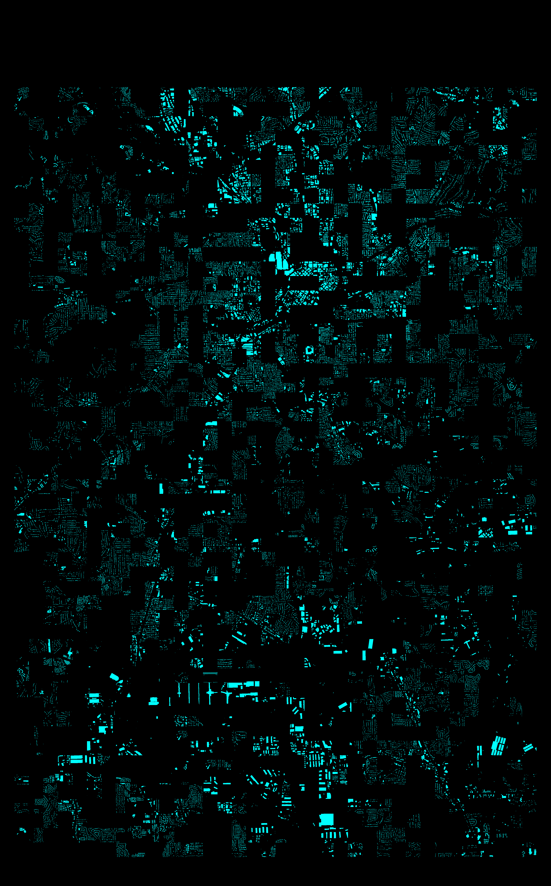
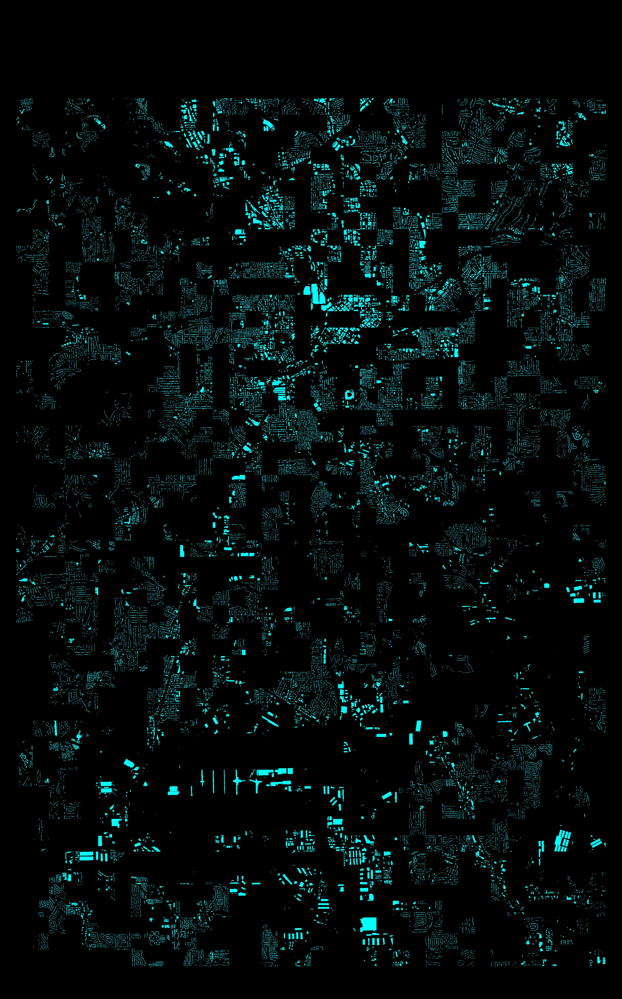
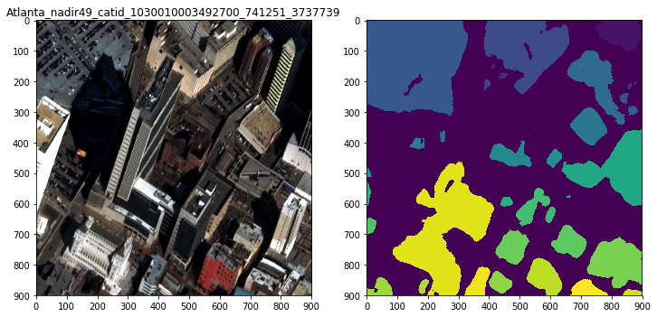
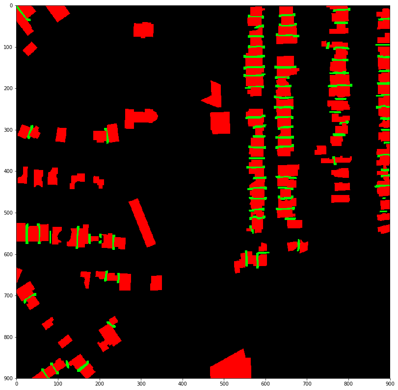

# XD_XD’s report

## My approach

As already described on the DownLinQ blog[1], my approach is U-Net model with VGG16 encoder. The encoder is pretrained on ImageNet. Pretrained models helps to improve the accuracy. I used 5 folds cross-validation for local validation. Due to the time limitation for training, I used first 4 of 5 folds for averaging models.

[1] “The SpaceNet Challenge Off-Nadir Buildings: Introducing the winners” https://medium.com/the-downlinq/the-spacenet-challenge-off-nadir-buildings-introducing-the-winners-b60f2b700266

## Other things I tried: Other encoders

As for the encoder of U-Net, I tried to use DPN and ResNet. Their performance are almost same in my experiment. On the other hand, VGG11 scores significantly worse than VGG16 on the provisional leaderbaord.

## Other information I feel would be useful

### Bug on preprocessing part

The baseline code provided by the organizer has a bug to generate incorrect label masks. I fixed it, but it’s no significant impact for improving the evaluation score. See following images. First mask image (train_mask_v1.png) is generated by the original code. Second one (train_mask_v4.png) is generated by the fixed code.

### Error analysis: Tall buildings

As a result of error analysis, the segmentation result of the tall building was terrible. If the test image contains all off-nadir angles, other interesting approaches might be possible. For example, 3D modeling

### Touching border

I tried to use a touching border mask[2], but it doesn’t significantly improve the evaluation score in my experiment.

[2] "[ods.ai] topcoders, 1st place solution" https://www.kaggle.com/c/data-science-bowl-2018/discussion/54741

